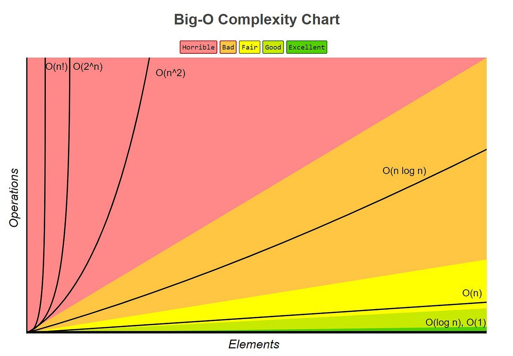

# Big O Notation

A mathematical notation that describes the limiting behavior of a function, especially in the context of algorithm analysis.

<table>
  <thead>
    <tr>
      <th>Time Complexity</th>
      <th>Algorithm</th>
    </tr>
  </thead>
  <tbody>
    <tr>
      <td>O(1)</td>
      <td>
        Looking up a specific element in an array, like: 
        <code>print(my_array[97])</code> 
        No matter the size of the array, an element can be looked up directly; it just requires one operation.
        (This is not really an algorithm, but helps understand time complexity.)
      </td>
    </tr>
    <tr>
      <td>O(n)</td>
      <td>
      <a href="../Arrays/lowest.js">Finding the lowest value.</a>
         
        The algorithm must do <code>n</code> operations in an array with <code>n</code> values, because it has to compare each value one time.
      </td>
    </tr>
    <tr>
      <td>O(n²)</td>
      <td>
        <a href="../Arrays/bubbleSort.js">Bubble sort</a>, <a href="../Arrays/selectionSort.js">Selection sort</a>, and <a href="../Arrays/insertionSort.js">Insertion sort</a> have this time complexity. 
        These algorithms slow down significantly with large data sets. 
        For example, increasing <code>n</code> from 100 to 200 can increase operations up to 30,000!
      </td>
    </tr>
    <tr>
      <td>O(n log n)</td>
      <td>
        <a href="../Arrays/quickSort.js">Quicksort algorithm</a> has an average time complexity of <code>O(n log n)</code>. 
        It's generally faster than the sorting algorithms above. 
        Note: Worst case for Quicksort is still <code>O(n²)</code>, but the average case makes it attractive.
      </td>
    </tr>
  </tbody>
</table>
 

