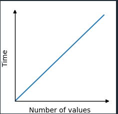

# Algorithm Time Complexity

Is the way to describe how the execution time of an algorithm grows as the input size increases.
For example, in an array to [**find the lowest value**](../Arrays/lowest.js).

